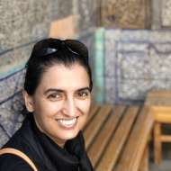
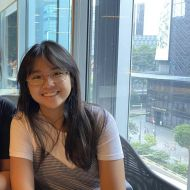
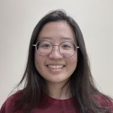
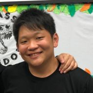
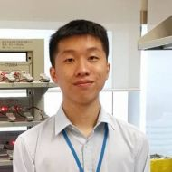

```{r setup, include=FALSE}
knitr::opts_chunk$set(echo = FALSE)
```

<style>
h1{color:#096B72;}
h2{color:#096B72;opacity:.85}
</style>

# Who are we?
We are a group of staff and students from the Special Programme in Science (SPS), under the National University of Singapore (NUS). 
SPS adopts a unique approach towards teaching and learning of interdisciplinary science. Find out more here [sps.nus.edu.sg](http://sps.nus.edu.sg).


|                                                             |                                                             |                                                             |
| :----------------------------------------------------------: | :----------------------------------------------------------: | :----------------------------------------------------------: |
|  |  |  |
|   [Linda Sellou](http://sps.nus.edu.sg/user/linda.sellou/)   |   [Kellie Wong](http://sps.nus.edu.sg/user/kellie.wong19/)   |   [Kellisa Goh](http://sps.nus.edu.sg/user/kellisa.goh19/)   |
|  |  |                                                              |
|    [Darren Teo](http://sps.nus.edu.sg/user/darren.teo19/)    |    [Tee Kai Ze](http://sps.nus.edu.sg/user/kaize.tee19/)     |                                                              |
