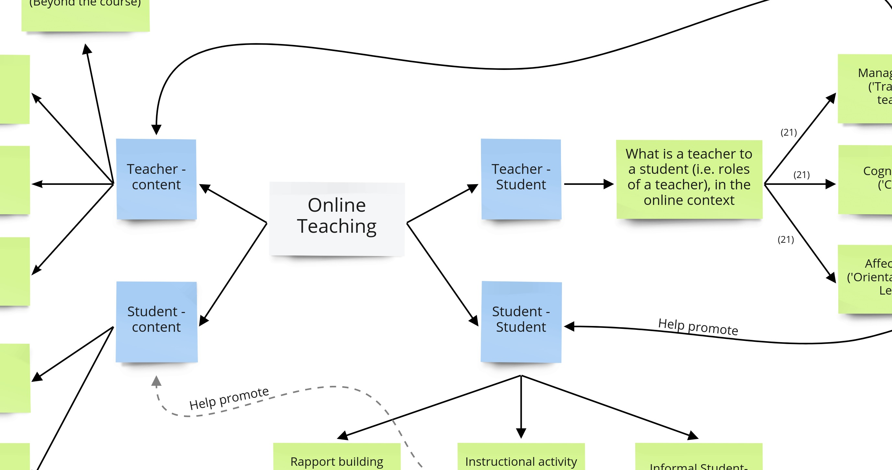
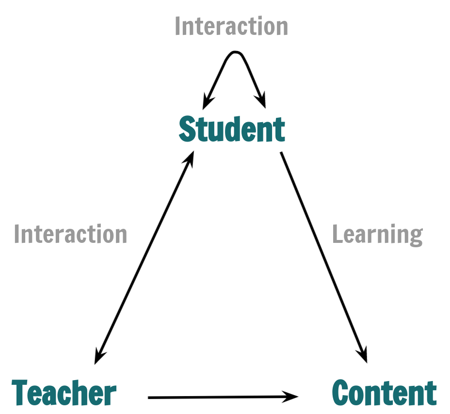

```{r setup, include=FALSE}
knitr::opts_chunk$set(echo = FALSE)
xaringanExtra::use_panelset()
library(readr)
library(dplyr)
library(magrittr)
# library(kableExtra)
library(DT)
# Learn more about creating websites with Distill at:
# https://rstudio.github.io/distill/website.html

# Learn more about publishing to GitHub Pages at:
# https://rstudio.github.io/distill/publish_website.html#github-pages
```

<style>
h1{color:#096B72;}
h2{color:#096B72;opacity:.85}
.front-img{
opacity:.5
}
</style>

```{r,out.width='100%',fig.align='center',class.source="front-img"}

```


## What is this site for?

This site is a platform where we will share all the resources we have and found about online teaching. We welcome your contribution. You can do so by leaving a comment under any piece of content that interests you or drop us an email! We hope this website becomes an invaluable resource and a form of support for our journey. 

This site was setup as part of an e-workshop organised by Special Programme in Science (SPS) and Faculty of Science of NUS and other ASEAN universities with the support of the Temasek Foundation International (TFI). The workshops was one of several e-workshops and e-talks of the series.

## Our approach and credo towards online teaching & learning

```{r,out.width='50%',fig.align='center',eval=FALSE}

```


Our credo towards online learning is creating a conducive, inclusive and safe learning environment for all students. 
Consequently, there are many aspects to online teaching, and here is how we organised them:

The main umbrella terms would be:

<table style="border:none;">
<tr>
<td style="width:50%">
<ul>
<li> **Teacher - Content** (on delivery of content), </li>
<li> **Student - Content** (on learning), </li>
<li> **Teacher - Student** Interaction and </li>
<li> **Student - Student** interaction. </li>
</ul>
</td>
<td style="width:50%;text-align:right;"></td>
</tr>
</table>

We have curated several resources (given in the table below) for each of these umbrella terms that would be easy to browse and read through. Each article could be based on literature, where we will direct you to other sites for more in-depth reading if you wish to explore beyond what we have for you, or based on the SPS experience, where you may contact the author for more in-depth discussion if you wish. 


## Resources and References

```{r}
df_references <- read_csv("References - Full list.csv", 
    col_types = cols(`ID Number` = col_skip(), 
        Link = col_skip()))

names(df_references)[4] <- 'Link'

df_references %>%
  datatable(escape = F,class='display', options = list(pageLength = 10, scrollX=T))
```

